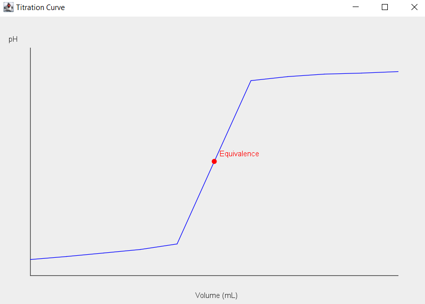

## Author
Emilly Owino

# Java Acid–Base Titration Simulator

Simulates an acid-base titration in Java, calculates pH at each step, detects the equivalence point, and graphs the titration curve using Swing.

## Features
- Takes acid/base concentrations and volumes as input.
- Calculates moles and pH for each addition.
- Detects and prints the equivalence point.
- Displays a live titration curve graph.
- Stores experiment data (pH, volume, region) in a **SQLite database**.
- Compare previous experimental runs and compute average pH.

---

## 📂 Project Structure

Titration.java/
│
├── src/
│ ├── Chemistry.java # Main program, handles user input
│ ├── TitrationSimulator.java # Core simulator logic, equivalence detection, and data saving
│ ├── TitrationGraph.java # Generates graph of pH vs. volume using Swing
│ ├── SqlManager.java # Manages SQLite connection and data storage
│ ├── ExperimentData.java # Handles experiment serialization (JSON + Gson)
│ ├── lib/
│ │ ├── gson-2.10.1.jar # Gson library for JSON
│ │ └── sqlite-jdbc.jar # SQLite JDBC driver
│ └── experiments.json # Optional: sample experiment data
│
├── graph_screenshot.png # Screenshot of a titration curve
└── README.md

## Screenshot



---

## ⚙️ How to Run

Make sure you have **Java 17+** and the **SQLite JDBC driver** in `src/lib/`.

```bash
# Compile all source files
javac -cp ".;src;lib/*" src/*.java

# Run the simulator
java -cp ".;src;lib/*" Chemistry

java -cp ".;src;lib/*" CompareExperiments

